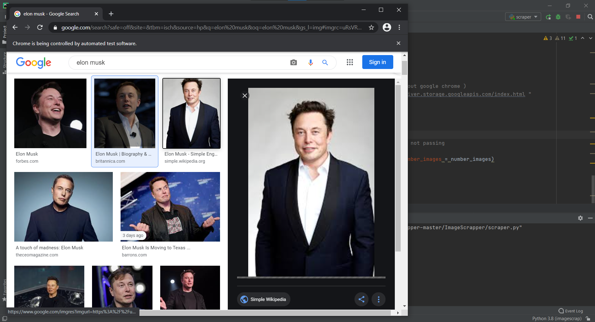
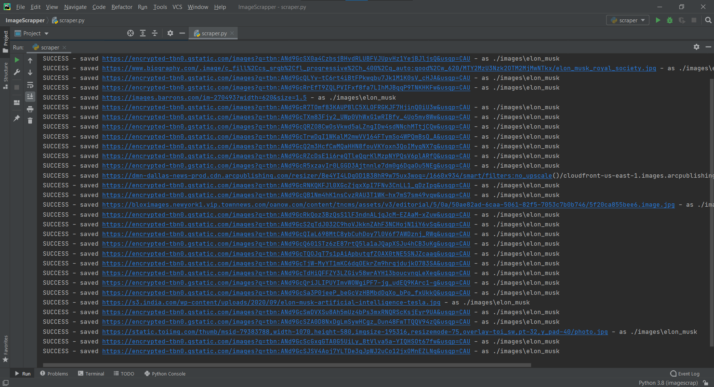
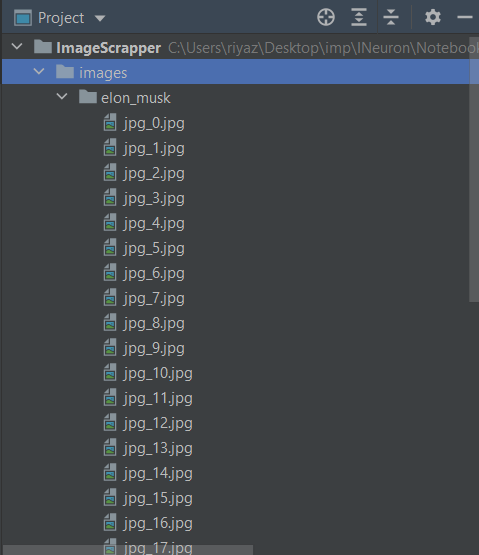
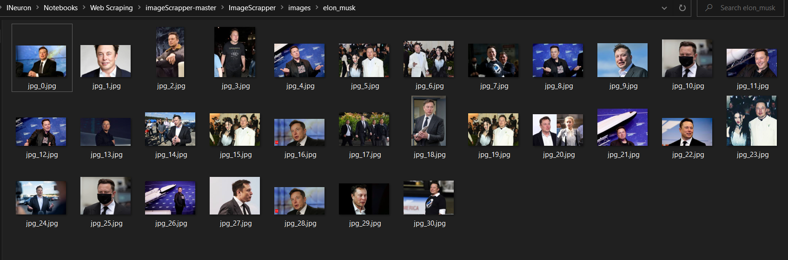

# Ineuron Web Image Scrapping Assignment
To View My Review Scrapping Project Please Visit [ReviewScrapper](https://reviewscrapml.herokuapp.com/)

## 1.Project

## 2.Executing Selenium
This is getting the every pictures link and storing them

## 3.Downloading The colledted Link And Saving in Local Directory

## 4. These Are The Pictures In My Local Directory

# Thank You
